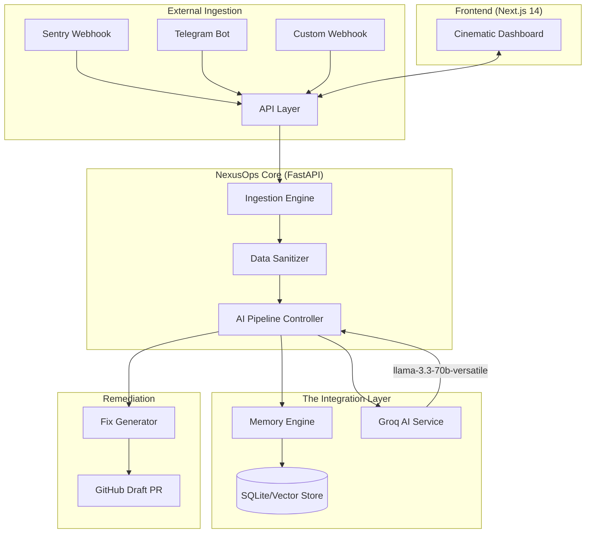

# 🚀 NexusOps 2.0: Next-Gen AI-Powered AIOps Platform

[](https://github.com/soumyachk101/NexusOps-2.0)
[](https://nextjs.org/)
[](https://fastapi.tiangolo.com/)
[](https://groq.com/)

**NexusOps** is an intelligent, high-performance incident management and automated remediation platform. It bridges the gap between production errors and developer resolution by combining **Real-time Ingestion**, **AI Root Cause Analysis**, and a **Team Memory Engine** to generate production-ready fixes in seconds.

---

## 🏗️ Architecture Overview

NexusOps is built on a distributed, event-driven architecture designed for speed and reliability.



---

## 🛠️ Key Features

### 1. 🧠 Memory-Enriched AutoFix (The Showpiece)
NexusOps doesn't just look at an error; it looks at your team's **history**. Before analyzing an incident, it queries the **Memory Engine** to find past discussions, related documentation, or previous decisions.
*   **Contextual Awareness:** "This error was discussed in Telegram last Tuesday regarding the auth migration."
*   **Smart Analysis:** AI combines live stack traces with memory context for deep root-cause discovery.

### 2. ⚡ Lightning Fast Remediation (Powered by Groq)
By leveraging **Groq API** and LLaMA 3.3, NexusOps generates root-cause analyses and code fixes in sub-seconds.
*   **Automatic Sanitization:** PII and secrets are stripped locally before data ever reaches the AI.
*   **Draft PRs:** Automatically generates GitHub Pull Requests with detailed explanations and safety scores.

### 3. 🕸️ Omni-Channel Ingestion
*   **Telegram Integration:** Directly ingest team conversations into the knowledge base.
*   **Webhook Native:** First-class support for Sentry, GitHub Deploys, and Custom monitoring tools.

### 4. 🛡️ Safety & Security First
*   **Confidence Scoring:** Every AI fix includes a confidence score and a safety assessment (SAFE, REVIEW_REQUIRED, BLOCKED).
*   **Data Management:** Full control over retention policies, sanitization rules, and data export.

---

## 🌊 System Workflow

1.  **Ingest:** An error occurs in production; Sentry sends a webhook to NexusOps.
2.  **Sanitize:** The platform strips API keys and user emails from the stack trace.
3.  **Enrich:** The Memory Engine searches for related documentation or past chat messages.
4.  **Analyze:** Groq AI performs a root-cause analysis using the sanitized trace + memory context.
5.  **Fix:** A minimal, safe code fix is generated.
6.  **Remediate:** A Draft PR is created on GitHub, and the team is notified via the Cinematic Dashboard.

---

## 💻 Tech Stack

*   **Frontend:** Next.js 14 (App Router), Tailwind CSS, Framer Motion, Lucide React.
*   **Backend:** FastAPI (Python 3.12), SQLAlchemy, Uvicorn.
*   **Database:** SQLite (with migration paths to PostgreSQL).
*   **AI Inference:** Groq Cloud (LLaMA 3.3 70B Versatile).
*   **Authentication:** NextAuth.js (GitHub & Google OAuth).

---

## 🚀 Getting Started

### Prerequisites
- Python 3.12+
- Node.js 18+
- Groq API Key

### Installation

1.  **Clone the Repository:**
    ```bash
    git clone https://github.com/soumyachk101/NexusOps-2.0.git
    cd NexusOps-2.0
    ```

2.  **Backend Setup:**
    ```bash
    cd backend
    python -m venv venv
    source venv/bin/activate  # Windows: venv\Scripts\activate
    pip install -r requirements.txt
    # Create .env based on .env.example
    uvicorn app.main:app --reload
    ```

3.  **Frontend Setup:**
    ```bash
    cd frontend
    npm install
    # Create .env.local based on .env.example
    npm run dev
    ```

---

## 📄 License

Distributed under the MIT License. See `LICENSE` for more information.

---

**Built for the Next Generation of SREs.**
[GitHub Showcase](https://github.com/soumyachk101/NexusOps-2.0)
