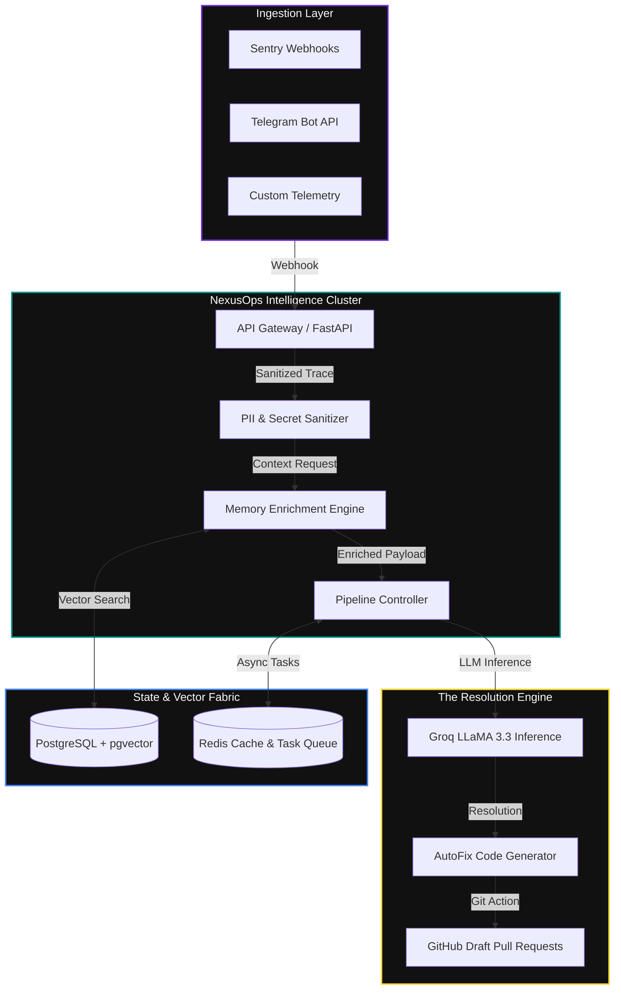
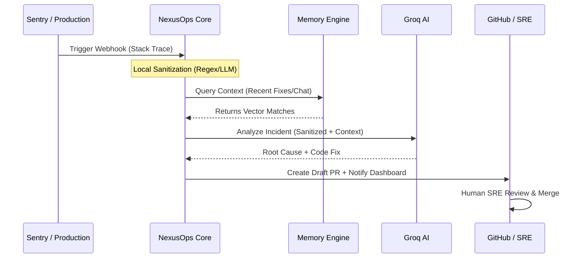

<div align="center">

# 🚀 NexusOps 2.0
### **The Intelligent Command Center for Modern AIOps**

[](https://github.com/soumyachk101/NexusOps-2.0)
[](https://fastapi.tiangolo.com/)
[](https://nextjs.org/)
[](https://groq.com/)
[](LICENSE)

---


**NexusOps 2.0** is an enterprise-grade, high-fidelity operational intelligence platform. It transforms production noise into actionable resolution by merging **Real-time Event Ingestion**, **Historical Team Memory**, and **Sub-second AI Remediation**.

[Explore Dashboard](https://github.com/soumyachk101/NexusOps-2.0) • [View Architecture](#-architectural-deep-dive) • [Setup Guide](#-getting-started)

</div>

---

## 📑 Table of Contents
- [✨ Core Philosophy](#-core-philosophy)
- [🏗️ Architectural Deep Dive](#️-architectural-deep-dive)
- [🧠 The Intelligence Engines](#-the-intelligence-engines)
- [🌊 Incident Lifecycle](#-incident-lifecycle)
- [🛡️ Engineering Standards](#️-engineering-standards)
- [💻 Tech Stack](#-tech-stack)
- [🚀 Getting Started](#-getting-started)
- [🗺️ Roadmap](#️-roadmap)

---

## ✨ Core Philosophy
NexusOps is built on the principle of **Context-Aware Remediation**. Unlike generic AI assistants, NexusOps understands that every production environment has a unique history. By indexing team discussions, documentation, and past fixes, it provides "Senior SRE" level insights in milliseconds.

---

## 🏗️ Architectural Deep Dive

NexusOps is engineered as a distributed, event-driven ecosystem. It features a stateless API layer, an asynchronous task pipeline, and a vectorized memory fabric.



---

## 🧠 The Intelligence Engines

### 1. The Memory Engine (Contextual Awareness)
Standard AIOps tools lack memory. NexusOps solves this using a **RAG (Retrieval-Augmented Generation)** pipeline over a vector database:
- **Telegram/Slack Siphoning**: Ingests team discussions into the knowledge graph.
- **Runbook Mapping**: Automatically links active incidents to internal documentation.
- **Historical Deduplication**: Identifies if a similar incident was resolved previously.

### 2. The AutoFix Pipeline (Sub-Second Remediation)
Leveraging **Groq's LLaMA 3.3**, we achieve near-instantaneous root cause analysis:
- **Trace Decomposition**: Breaks down complex stack traces into logical components.
- **Confidence Scoring**: Each AI-generated fix includes a safety assessment (SAFE, REVIEW, BLOCKED).
- **PR Automation**: Stages Draft PRs with full technical context for the SRE to review.

---

## 🌊 Incident Lifecycle

The following sequence illustrates the automated handling of a production fault:



---

## 🛡️ Engineering Standards

- **Security-First**: Regex-based sanitization strips PII and credentials at the ingestion gateway.
- **Async Reliability**: Heavy AI processing and git operations are handled by Celery workers to keep the UI snappy.
- **High Performance**: PostgreSQL + `pgvector` ensures semantic search remains performant at scale.
- **Human-in-the-Loop**: The platform never pushes code without explicit SRE approval.

---

## 💻 Tech Stack

- **Frontend**: Next.js 14 (App Router), Framer Motion, Tailwind CSS, Shadcn/UI.
- **Backend**: Python 3.12, FastAPI, SQLAlchemy (Async), Celery/Redis.
- **Storage**: PostgreSQL with `pgvector` for semantic search.
- **AI**: Groq API (LLaMA 3.3 70B Versatile).

---

## 🚀 Getting Started

### Quick Start (Docker)
The fastest way to experience NexusOps 2.0 is via Docker Compose:

```bash
docker-compose up --build
```

### Manual Installation

**1. Clone & Environment**
```bash
git clone https://github.com/soumyachk101/NexusOps-2.0.git
cd NexusOps-2.0
cp backend/.env.example backend/.env
cp frontend/.env.local frontend/.env
```

**2. Backend Setup**
```bash
cd backend
python -m venv venv && source venv/bin/activate
pip install -r requirements.txt
uvicorn app.main:app --reload
```

---

## 🗺️ Roadmap

- [x] **v2.0**: Core Memory Engine & AutoFix Pipeline.
- [x] **v2.1**: GitHub PR Automation & Sentry Webhooks.
- [ ] **v2.2**: Slack/Teams Integration (Phase 4).
- [ ] **v2.3**: Multi-cloud Auto-Revert (Phase 5).
- [ ] **v2.4**: Advanced Analytics & MTTR Tracking.

---

## 📄 License & Attribution

Distributed under the MIT License. Built with ❤️ for the Next Generation of SREs by **Soumya Chakraborty**.

[Showcase Dashboard](https://github.com/soumyachk101/NexusOps-2.0) | [Documentation](https://github.com/soumyachk101/NexusOps-2.0)