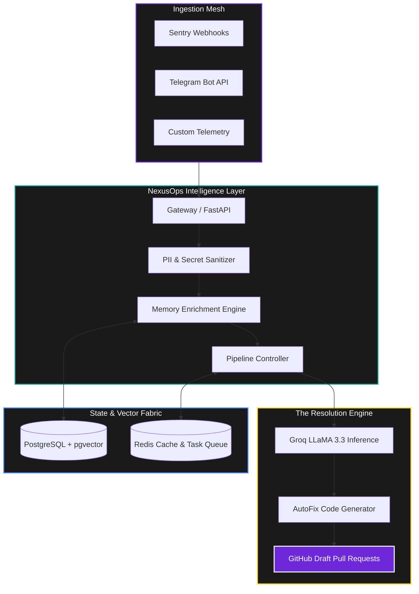

<div align="center">

# 🚀 NexusOps 2.0
### **The Intelligent Command Center for Modern AIOps**

[](https://github.com/soumyachk101/NexusOps-2.0)
[](https://fastapi.tiangolo.com/)
[](https://nextjs.org/)
[](https://groq.com/)

---


**NexusOps 2.0** is a premium, high-fidelity operational intelligence platform that transforms production chaos into actionable resolution. By merging **Real-time Event Ingestion**, **Historical Team Memory**, and **AI-Driven Remediation**, NexusOps empowers SREs to resolve complex incidents with surgical precision.

</div>

---

## 🏗️ Architectural Core

NexusOps is engineered as a distributed, event-driven ecosystem. It doesn't just process data; it understands context.



---

## 🧠 Core Capabilities

<table width="100%">
  <tr>
    <td width="50%" valign="top">
      <h3>🧠 Memory Engine</h3>
      <p>A vector-based knowledge store that injects historical context into every incident. It searches past Telegram discussions, runbooks, and historical fixes to give AI the "team memory" it needs.</p>
    </td>
    <td width="50%" valign="top">
      <h3>⚡ AutoFix Pipeline</h3>
      <p>Powered by <b>Groq's LLaMA 3.3</b>, the AutoFix engine performs sub-second analysis to find the hidden bug and stage a Draft PR with detailed safety scores.</p>
    </td>
  </tr>
  <tr>
    <td width="50%" valign="top">
      <h3>🛡️ Sanitization Layer</h3>
      <p>Local, regex-based sanitization that strips PII (emails, keys, IPs) before data ever leaves your infrastructure. Security by design.</p>
    </td>
    <td width="50%" valign="top">
      <h3>🕸️ Omni-Channel Ingestion</h3>
      <p>Native support for Sentry, Telegram, and Custom Webhooks, allowing your team to monitor production from where they already work.</p>
    </td>
  </tr>
</table>

---

## 🌊 The NexusOps Workflow

> [!TIP]
> **NexusOps follows a "Human-in-the-Loop" philosophy.** The AI analyzes and stages, but the human SRE always makes the final call.

1. **Ingest**: A production error triggers a Sentry webhook.
2. **Enrich**: The Memory Engine injects historical context into the incident report.
3. **Analyze**: Groq AI generates a root cause analysis in **< 500ms**.
4. **Draft**: A code fix is generated and staged as a **GitHub Draft PR**.
5. **Notify**: The team is alerted via the **Cinematic Dashboard** and Telegram.

---

## 💻 Tech Stack

- **Frontend**: Next.js 14 (App Router), Framer Motion, Tailwind CSS, Shadcn/UI.
- **Backend**: Python 3.12, FastAPI, SQLAlchemy (Async), Celery/Redis.
- **Storage**: PostgreSQL with `pgvector` for semantic search.
- **AI**: Groq API (LLaMA 3.3 70B Versatile).

---

## 🚀 Getting Started

### Quick Start (Docker)
The fastest way to experience NexusOps 2.0 is via Docker Compose:

```bash
docker-compose up --build
```

### Manual Installation

**1. Clone & Environment**
```bash
git clone https://github.com/soumyachk101/NexusOps-2.0.git
cd NexusOps-2.0
cp backend/.env.example backend/.env
cp frontend/.env.local frontend/.env
```

**2. Backend Setup**
```bash
cd backend
python -m venv venv && source venv/bin/activate
pip install -r requirements.txt
uvicorn app.main:app --reload
```

---

## 📄 License & Attribution

Distributed under the MIT License. Built  for the Next Generation of SREs by **Soumya Chakraborty**.

[Showcase Dashboard](https://github.com/soumyachk101/NexusOps-2.0) | [Documentation](https://github.com/soumyachk101/NexusOps-2.0)
